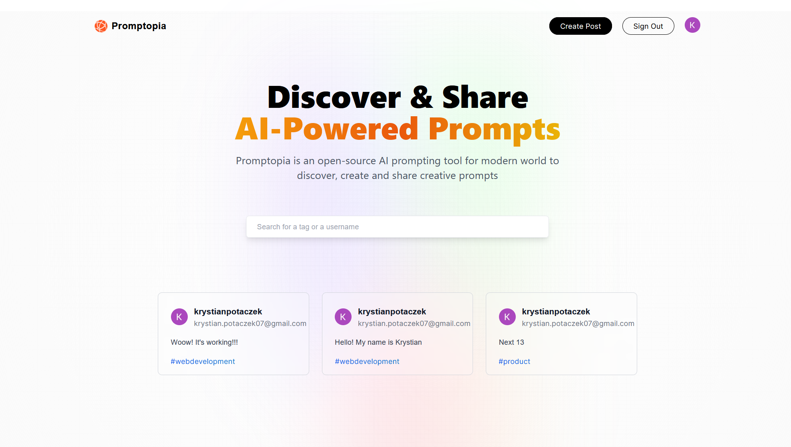

<br />
<div align="center">
  <h1 style="margin-bottom: 50px">Promptopia App </h1>

[](http://forthebadge.com)
[](http://forthebadge.com)

 
</div>

# 🚩 Table of Contents

- [🚩 Table of Contents](#-table-of-contents)
  - [🚀 Live Demo](#-live-demo)
  - [✨ About of Project](#-about-of-project)
  - [🔭 Features](#-features)
  - [📦 Built With](#-built-with)
  - [🌏 Getting Started](#-getting-started)
    - [Prerequisites](#prerequisites)
    - [🔧 Installation](#-installation)
  - [🐾 Roadmap](#-roadmap)
  - [📞 Contact](#-contact)

## 🚀 Live Demo

Link: https://next-promptopia-ewqsy0382-krystian2077.vercel.app/

## ✨ About of Project

Promptopia App is a project summarizing my knowledge about Next.js version 13.4. This project is my first experience with Next.js. In my opinion it is a powerful, fun and effective tool for building web applications.

## 🔭 Features

- Next 13.3 and React
- Full Responsive
- Tailwind Styling
- NextAuth
- Google Provider
- Search for tags, username and prompt content
- Dynamic and nested routes
- Profile component with edit/delete your post
- Viewing other people's profiles

## 📦 Built With

<p align="center">
  <a href="https://skillicons.dev">
    
  </a>
</p>

## 🌏 Getting Started

To run this project, install it locally using npm.

### Prerequisites

Install the latest version of npm in your runtime.

- npm

  ```sh
  npm install npm@latest -g
  ```

### 🔧 Installation

1.  Clone the repo

    ```sh
    git clone https://github.com/krystian2077/next-promptopia
    ```

2.  Install NPM packages

    ```sh
    npm install
    ```

3.  Run npm script

    ```sh
    npm run dev
    ```

## 🐾 Roadmap

- Add chat messenger
- Add ability to add a movie to prompt

<!-- CONTACT -->

## 📞 Contact

Email: krystian.potaczek07@gmail.com

My phone number: 788-986-074
